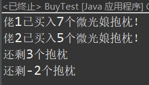

> 难度系数：普通
>
> 一个人单打独斗的力量是小的，而当一群人一起干活的时候往往能发挥强大的力量。人是如此，JAVA程序也是这样，作为JAVA的核心技术，多线程有着举足轻重的影响力✊。
>
> 我们通常将每个任务(Task)称为一个进程(Process)，而一个进程可以包含多个线程(Thread)，让我们一起走进多线程的世界吧！

# Java方向-05：多线程
## Task1：一点开胃菜

1. 谈谈你对进程和线程的理解。
1. 了解一下JAVA中实现多线程的几种方法。
1. 用**2种**方法完成**从1数到100**这个数数小问题吧🎲
> 以下是通过实现Runnable接口完成的部分代码，在j=20时再多开启两个线程，分别命名为Thread-1和Thread-2

```
private int i=0;
@Override
public void run()
{
    for(;i<100;i++)
    {
        System.out.println(Thread.currentThread().getName()+":"+i);
    }
}
    
public static void main(String[] args)
{
    for(var j=0;j<100;j++)
    {
        System.out.println(Thread.currentThread().getName()+":"+j);
        if(j==20)
        {
            //...增加代码
        }
    }
}
```

- 首先再试试以Lambda表达式的形式实现一下Runnable接口吧！

**代码结果分析**

- 调用start方法开启线程和直接调用run方法有什么区别？
- Thread-1和Thread-2都会数100下吗？为什么 i 值最后不是200？
- 对比一下你使用的2种方法的优劣势。

## Task2：抢购抱枕！

> 微光工作室定制了一批 微光娘 抱枕🤗！群友们都蜂拥而上抢抱枕了！

题目描述：
（注：以下所有代码省去set，get方法和构造器）
模拟抢购抱枕的情景，首先有**工作室管理类**🏠️
```
public class Glimmer
{
    private String Id;           //代表各工作室财产编号，抱枕为cushion
    private int remainNum;       //代表剩余数量
}
```
然后是**买抱枕过程类**
```
public class BuyThread extends Thread
{
    private Glimmer glimmer;
    private int buyNum;      //代表购买数量

    public void run()
    {
        //如果剩余数量足够
        if(glimmer.getRemainNum() >= buyNum)
        {
            System.out.println(getName()+"已买入"+buyNum+"个微光娘抱枕！");
            glimmer.setRemainNum(glimmer.getRemainNum()-buyNum);
            System.out.println("还剩"+glimmer.getRemainNum()+"个抱枕");
        }
        else
            System.out.println("剩余量不足，购买失败");       
    }
}
```
最后是一个**测试类**
```
public class BuyTest 
{
    public static void main(String[] args) {
        Glimmer glimmer = new Glimmer("cushion",10);
        new BuyThread("佬1",glimmer,7).start();
        new BuyThread("佬2",glimmer,5).start();
    }
}
```

问题出现了！测试结果竟是这样？！



#### 要求：

- 谈谈为什么会出现这样的结果。

- 改进这些程序，使得再次执行BuyTest类时能出现如下结果：（最好能使用2种方法）

	> 当佬1买完，佬2打算遗憾离场的时候，微光工作室竟然又进货了！
	>

- 假设在佬1买完后 微光工作室又先进货了1个，又进货了6个😻。请继续改进程序，使得执行测试类时，能得到如下结果：
  （可修改测试类和增加新的类，但测试类中 `new BuyThread("佬2",glimmer,5).start();`只能出现一次）

  

## Task3：Main dish！

> Node偶然发现了一份电子科技大学的英文介绍简章，但他在无意中得知这份文件中的第101字节到2214字节是隐藏的秘密内容㊙︎，Node决定写一段程序来拷贝这段内容到自己电脑上，他害怕自己拷贝得不够快，决定多开几个线程一起Copy！


用于拷贝的文件在如下地址下载：[https://github.com/Bri1987/useFile](https://github.com/Bri1987/useFile)
可以将它下载下来放到D盘里，模拟一下上述场景
[
](https://github.com/Bri1987/useFile.git)
**题目描述：**帮Node完成上述这样一段拷贝代码
要求：

- 实现 多线程拷贝
- 让Node看到拷贝任务的完成进度条

进度条以下图示例方式显示（假设开启了3个线程）：


> Node又害怕自己拷贝到一半，被人发现了而被迫暂停😱，Node希望你再添加一个小功能，使得即使拷贝被中途暂停，再次拷贝时能从上次拷贝被暂停的地方开始继续拷贝。

-  实现断点拷贝的功能（如果觉得提供的测试文件大小太小，不适合进行断点测试，可寻找使用其他文件进行测试）
	- `实现后，例：第一次拷贝到一半就暂停：`
	
	 `
	- `第二次接着上次继续拷贝：`
	
	 

## 拓展部分

- 多线程能帮助我们显著加快任务执行的速度，但事实上系统启动一个新线程的成本是相当高的，因为它涉及与操作系统的交互。而当程序中需要创建大量生存期很短暂的线程时，使用**线程池**🏊︎能很好地提高性能。一起来玩玩线程池吧，试着用线程池实现一个java程序，结合**归并算法**的思想，将1000个随机数分成多个区间，计算这1000个随机数的和！

- （选做，真的有兴趣的话可完成）了解一下异步响应与同步响应的不同，了解一下java9增加的便于线程间交换数据的**发布-订阅**框架，随便写一个测试类，感受体现一下该框架的特性。

## 需要掌握的知识点

- Java 多线程基本知识点（Task1）
- 线程同步和线程通信（Task2）
- 一些Java 文件I/O（Task3）


## Tips
- 想访问读写文件的任意位置？看看RandomAccessFile类吧


## 回答要求

- 完成本题过程中你遇到了什么困难，你是怎么解决的？
- 对于需要编程实现的**Task**，请提交最终能够运行的演示代码

## 本题提交方式

> 收件邮箱：[glimmer401@outlook.com](mailto:glimmer401@outlook.com)
>
> 主题格式：学号-姓名-考核-Java-05
>
> 主题示例：202209090101-大佬-考核-Java-05

## 出题者Q&A方式
> QQ：1216754835
>
> 邮箱：[1216754835@qq.com](mailto:1216754835@qq.com)

