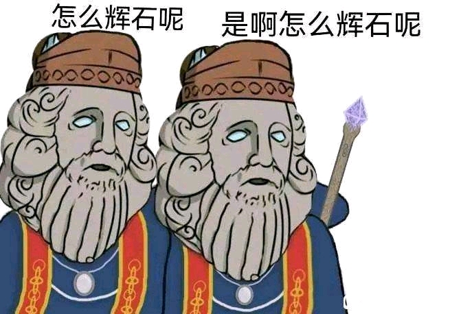

# 前端-01 welcome！

**前端-01**

> 难度系数：入门

> 相信你已经看过了前端的简介，对前端有了大致的了解。（什么！？你没有看?快去看看前端的简介！）或许你还有一些难以理解的地方，没关系，不要着急，都说实践出真知，接下来，我们希望通过一系列题目，通过实践的方式，手把手带你入门前端。你需要根据下面的题目指引，完成任务，如果遇到不会的，**将这些问题复制粘贴到搜索框 ，往往会解决你的大部分问题**，当然了，你也可以在题目的底部发现题目的出题人，问问他们或许能找到不少帮助，祝你好运！

## 题目描述

当你踏上程序员这条道路时，会不会有这样的想法：**我要用代码创造出一些属于我自己的东西。**如果有，那我想那一个个网站或许能戳到你。

1.先试着了解网页的组成

2.而这一题你的最终目标就是写出一个令你自己满意的静态个人页面。把它当成一张画纸，试着把你学到的东西都运用到上面吧！

## 题目要求

### step1：试着描改一下吧！

使用伟大的**F12**来修改一个网页吧！**截屏记录**下你改**前后**的网页截图，并说出这些你修改的部分是什么元素，有什么属性。

### step2：写出一个令你自己满意的静态个人页面吧！

1. 可以把它当成一个笔记本，记录一下你的学习成果
2. 尝试着美化一下它？
3. 顺便再介绍一下自己吧！

## 可能遇到的问题

**怎么做啊，完全不会啊？**

- 学习和了解什么是 HTML 标签 （一个基础的 HTML 框架是怎样的，它包含了几部分 、meta 标签 、h1 标签 、div 标签 这些都是什么东西 ? ）
- 掌握基本的 CSS 知识 （ 至少你需要知道什么是盒子模型 、基础布局方式有哪些 ? 怎么居中 ？ 怎么控制元素的位置 ？）

**什么是html/css啊？**

- [HTML 教程 | 菜鸟教程 ](https://www.runoob.com/html/html-tutorial.html)
- [HTML: HyperText Markup Language | MDN ](https://developer.mozilla.org/en-US/docs/Web/HTML)
- [CSS 教程 | 菜鸟教程](https://www.runoob.com/css/css-tutorial.html)
- [CSS: Cascading Style Sheets | MDN ](https://developer.mozilla.org/en-US/docs/Web/CSS)

**学完啦，还是不知道怎么做/做不出想要的效果/不知道哪里出问题了555**

- 参考他人的代码（不是copy
- 善用F12
- 复习一下学习内容
- Google
- 可以和群里的学长学姐交流交流

## 让我们更深入一点！

**动起来啊铁奥，为什么不动！**

不觉得静态页面很无聊吗，来点什么让他动起来好呢🤔（什么是静态页面 ？ 什么是动态页面？）

**怎么辉石呢？这网页怎么看着怪怪的**

在手机上打开的话，你的博客还ok吗？（尝试了解什么是 **媒体查询** ）

## **Tips**

- 回顾一下暑期学的css和html，把盒子模型、布局搞明白，了解什么是正常文本流，什么样的操作会使元素脱离正常文本流
- 多参考别人的博客，观察人家博客各个部分的作用并进行适当取舍

## 本题提交方式

> 收件邮箱：glimmer401[@outlook.com ](/outlook.com ) 
>
> 主题格式：学号-姓名-考核-前端-01
>
> 主题示例：2020091202014-张三-考核-前端-01
>
> 提交内容：你的 pdf（包含图片与描述）、HTML 、CSS 、JS 文件

## 出题者**Q&A方**式

>QQ: 3384604747
>
>邮箱:3384604747@qq.com
