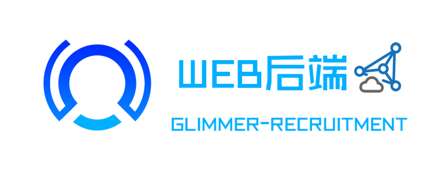

# 微光招新-Web后端

> 一个好看的皮囊固然重要😋，但里面有趣的灵魂也绝不可缺少😭。如果说前端是那好看的皮囊，那么后端便是那其中有趣的灵魂，负责着设计程序架构、管理数据库以控制前端所展示的内容。不同于前端，后端做的更多的是与**服务器**以及**数据库**进行交互以处理相应的业务逻辑，需要考虑的是如何实现相应的功能、数据的存取和平台的性能与稳定性等等。

> 目前最主流的后端开发语言当属**JAVA**，除此之外，**Python**、**PHP**、**Go语言**也有很广泛的应用。为了学好后端，掌握一门开发语言是必不可少的，除此之外，**Linux系统**的熟练使用、**数据库**的相关知识以及**计算机网络知识**也是你必须要了解的😘。

## ✨简介

后端开发其实不止包括Web开发，还包括基础架构。Web后端工程师在开发上会偏重业务，而后端基础架构会偏重于通用型更强的工作，二者技术栈差不多，只是分工不同。后端工程师追求的目标，都是开发出「高性能」「高并发」「高可用」的系统来。

本部分将面向一些后端的基础操作进行出题，不会涉及某一种编程语言的考察，但是在此之前，希望你能简单入门至少一种后端常用的编程语言😋

- Java
- Go
- Python
- 等等

本部分难度不会很大❤️，但是知识点多且杂😰，需要你有耐心地去一点一点地学习，这或许是个很枯燥的过程，但是当你坚持下来完成这些任务之后，相信你会获得很大的收获😁。

## ❓ 将会涉及的知识点

- 
Linux系统的使用

- 
数据库与SQL

- 
后端环境搭建与服务部署

## 💭 帮助

当你遇到困难时，不妨试试以下方式/网站

- [菜鸟教程](https://www.runoob.com)
- [Google](https://www.google.com)
- [CSDN](https://www.csdn.net)、[博客园](https://www.cnblogs.com)、[知乎](https://www.zhihu.com)甚至[b站](https://www.bilibili.com)等论坛
- 查阅官方文档
- [直接问群里的老学长](https://github.com/ryanhanwu/How-To-Ask-Questions-The-Smart-Way)
