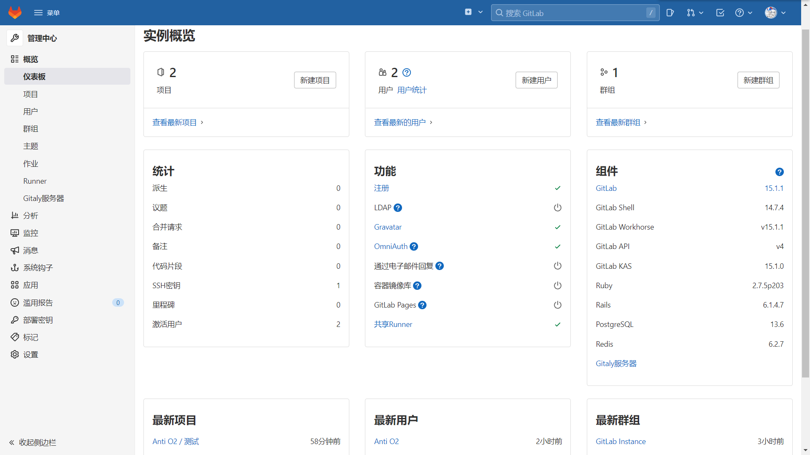

# 日常-04：Git

> `难度系数`：普通
>
> **还在用QQ传代码？或许可以试试git**

## 题目描述

- 🛠️1.安装Git
  - Windows平台[Git - Downloading Package (git-scm.com)](http://git-scm.com/download/win)
  - 在Linux系统中用对应的安装包工具安装

- 🏫2.学习使用git
  - 配置git的用户信息
  - 在本地创建自己的仓库
  - 了解暂存区、工作区、版本库是什么
  - 尝试添加文件到暂存区并提交
  - 学会创建、切换、合并分支
  - 学会合并冲突

- 🗝️3.使用远程仓库
  - 注册[GitHub](https://github.com/)或[Gitee - 基于 Git 的代码托管和研发协作平台](https://gitee.com/)账号
  - 尝试clone一份别人的仓库
  - 将你自己的本地仓库添加上去
  - 尝试更新本地的文件并提交

---

## 回答要求

- 记录下Git的使用方法

---

## 拓展部分

**这一部分要求你搭建自己的git服务器**

- Github本身不开源，也就是说你不能搭建自己的Github（像搭建wordpress那样）。不过可以搭一个类似的GitLab（并分享给你的~~儿子~~室友用）
- 你可以使用GitLab管理后台

- 搭建好Gitlab后尝试重复之前GitHub的任务

## 需要掌握的知识点

- git的使用

## Tips

- 不会的地方多使用网络搜索
- 也可以问群友

## 提交方式

> 不用提交

## 出题者Q&A方式

> QQ：1219935161
>
> 邮箱：antio2@qq.com