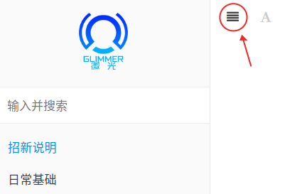

> 🎊各位xdm，欢迎参加微光工作室2022秋季招新🎊
>  
> 我们正式的考核从 `9月6日` 开始，至 `10月14日` 截止，欢迎各位前来挑战！

微光工作室欢迎各位大佬和萌新前来参加，本次招新以考核题形式进行。

🔴之前没有接触过计算机相关知识的伙伴，可以先学习`日常基础`部分

- 这部分`不需要提交`，但是是我们推荐的入门路线
- 如果不做这部分对直接做题影响不大，但我们建议没有基础或计算机基础较薄弱的同学做这部分的题

🔴开始做题前请先到`QQ群`下载报名表并提交

-  只有提交报名表后的答题才有效 
-  提交报名表后大家就可以根据自己的兴趣方向开始答题了 
-  答题方向不限，顺序不限 
-  如果有什么问题都可以问热情的群友们 

# 📋招新规则

🧾招新流程：

- 阶段一：考核题选拔（9月6日至10月14日）
- 阶段二：面试（第一阶段结束后一周内发布具体通知）
- 阶段三：进入工作室，一起van耍

🧾招新对象：

- 22级各位萌新、大佬们
- 21级有一定基础的hxd

🧾考核标准：

🔴我们不以答题数量或者题目难度作为考核标准

没有严格的方向限定

- 我们主要考察你在完成考核题中的学习能力、学习态度和解决问题的思路
- 考核依据的是你招新前后技术的提升，所以不用担心被大佬碾压，认真学，尽力完成考核题目，找到自己的兴趣就行了

❓该如何选择方向：

- 先了解一下每个方向是干什么的
- 可以尝试每个方向的题，看看自己对哪个方向比较感兴趣

❓群友：为什么我感觉招新题又多又难？

- 招新题多是为了覆盖不同方向，不同年级，不同基础的伙伴，不是说都要做。
- 部分招新题具有一定难度是为了应对不同水平的伙伴（比如21级和OI爷），是适应不同基础的人而已，只要认真学习了，没有完成也没事的

❓群友：我做一道题都要用很久时间，怎么办？

- 我们的题目是为了考察你的学习态度，学习能力，所以有一定难度是正常的
- 每一道题都是学长精心准备的题，都是需要你去学习一定知识才能完成的
- 考核题不以解答为目的，而是让你主动学习，我们希望看见你在解题过程中能力的提升
- 如果你认真对待每一道题，主动学习，即使没做出来也没事。
- （而且出简单了被你们一下就做完了显得我们多没面子😭）

🔔答题要求：

-  所有题目可任意选做，无前后顺序要求 
-  作答时尽量使用 `过程截图`+`解决思路`+`代码`的方式作答 
-  不一定要死磕C语音，其他方向也很不错 
-  群里的各位OI爷，除了C语言，数据结构外也可以尝试别的方向 
-  可以写出自己对涉及到的知识点的学习过程和理解 
-  遇到不会的请先按照题目给的帮助自学，实在有问题也可以联系出题人，但请尽量在自己实在想不通的情况下再问，学长学姐平时也是要上课的 
-  具体题目提交方式见下文 

# 📜开始做题

🖱️点击网页左上角的展开，然后选择对应的部分，开始挑战吧！

- 每个部分都有关于这个办法的简介，以及具体的考核题目
- 题目之间没有顺序要求，你可以做任何你感兴趣的题

> 如果进入网页后没有看到这个标志可能是加载原因，等一下或者刷新下就好了

# 📧提交规则

## 📄报名表提交规则

- 提交时间：2022年10月11日23：59前（比题目提交时间早几天）
- 去群文件里下载报名表，✏️填写后按照报名表下方要求发送即可

## 📄题目提交规则

- 提交时间：2022年10月14日23：59前

- 统一答题格式：

  - 使用markdown格式作答，并导出为pdf文件
    - ⚠️命名格式：学号-姓名-考核-题目编号如<u>2022091202014-张三-考核-后端-04</u>
    - 
  - 每完成一题就提交一次，`不支持打包多个提交`
    - 完成每道题目可能有出题人和你互动，了解你的情况
  - 如何使用markdown格式请参考日常基础部分第二题

- 提交方式：

  - 邮件命名为`学号-姓名-考核-题目编号`（和题目pdf文件的名字一样的）
  - 题目作答以 pdf 附件形式发送
  - 发送至邮箱glimmer401@outlook.com

  ❗部分题目对作答有特殊要求，具体见每道题下面是否有特殊要求

  ❗如果没有额外说明，则将题目按照上述要求发送即可

  ❗如果觉得做的不满意想重新提交，直接再发一次覆盖之前的就好了

# 🔑推荐学习路线

> 对于招新考核题的方向选择推荐，以及一些指导，建议阅读

## 📖基础路线

> 对于所有同学的一些必要的计算机基础知识,以及想提前预习大一课程要学的东西

`日常基础`：这个部分会教你一些计算机相关学习中的一些基本的工具、软件的使用、学习的习惯以及一些计算机小白需要了解的有关计算机的事

`C语言`：大一上的课程要求，也是计算机入门的一个很好的选择萌新和大佬们都可以尝试一下

`算法&数据结构`：计算机基础中非常重要的基本功之一，在这部分你可以学到如何更高效地计算、存储数据，大一上期末以及大一下学期就会学到，需要一点语言基础（边做边学也是一个好办法），建议大家也可以尝试

## 📚后端玩家

> 玩玩服务器，写点程序

`Java`：后端大部分使用JAVA语言

`Web后端基础`：后端玩家除了会写程序还要会玩服务器，这个部分会让你初步接触服务器并尝试一些简单的玩法

## 📕前端玩家

> 想写点~~花里胡哨~~漂亮的网站页面？来van前端啊！
>  
> 除了网页外，小程序和手机软件前端也可以把握住🤏看不惯后端还可以 node 把后端开发一脚踢开！

`Web前端`：学习前端使用的语言，写一点网页上的小功能

## 📔机器学习玩家

> 机器学习 = 学好数学 + 用一门方便的语言搞事情

`python`：听说机器学习跟 python 更配哦

`机器学习`：跟着走就ok

# 📬联系我们

官网：[https://glimmer.space](https://glimmer.space)

招新平台：[https://join.glimmer.space](https://join.glimmer.space)

招新QQ群：[174266824](https://jq.qq.com/?_wv=1027&k=KYjuOwgT)

欢迎来玩♂耍

