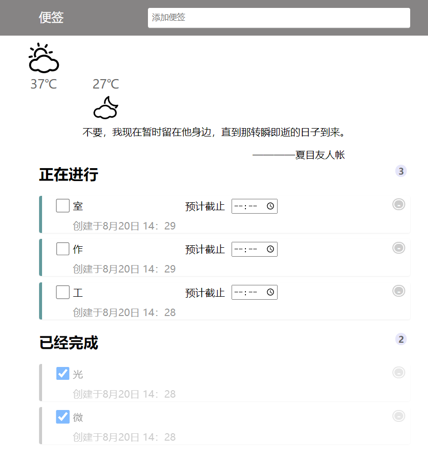

# 前端-03：前后端通信

> `难度系数：有点难了`
>  
> 前面的学习中，你了解了本地的一些操作，接下来，我们要迈向网络的诗和远方了（雾）。在这一题里，你将会接触到前后端的通信。如何调用服务器的数据，利用现成的各种接口，甚至自己搭建一个简易的服务器以储存数据，做好面临挑战的准备！

## 题目描述

---

如果想在自己的页面调用一个服务器上的内容，又不愿重新加载页面，就需要我们使用Ajax技术了。一般来说，网络上会提供一些免费的接口，供开发者使用，开发者可通过调用接口来获取相关信息。我们希望你利用网络上的一些API，来对你上一题的页面进行美化。比如这样：

## 题目要求

---

- 学会使用Ajax，通过调用API的方式获取相关元素，并渲染到你的日历中。比如： 
   - [和风天气](https://dev.qweather.com/)
   - [一言](https://developer.hitokoto.cn/sentence/)
   - [微博热搜](https://docs.tenapi.cn/resou.html#%E8%AF%B7%E6%B1%82url)

## 可能遇到的问题

- HTTP 请求是什么？或许你需要了解一些计算机网络的知识。
- Ajax 是什么？Ajax是怎么工作的？异步是什么？ 
   - [菜鸟教程 Ajax](https://www.runoob.com/ajax/ajax-tutorial.html)
   - [MDN Ajax](https://developer.mozilla.org/zh-CN/docs/Web/Guide/AJAX)
   - [异步是什么？](https://developer.mozilla.org/zh-CN/docs/Learn/JavaScript/Asynchronous/Introducing)

## 再进一步？

---

学习使用Node.js，尝试来自己写API。Node.js是运行在服务器端的JavaScript，在创建自己的服务时，它是一个非常好的选择。

-  用户可以登录和注册，并且登录信息要在页面中维持一段时间（也就是关闭页面后，一段时间内再次打开页面，还能保持登陆状态，并且**没有登录状态的时候，不能访问日历界面**）。 
-  支持多个用户登录，用户不能查看别人的便签，用户登录的用户名和密码需要保存在文件中。 

## 可能遇到的问题

---

- 我该怎么规范定义我的 API ？ 这里可以看看 [Restful API 规范](https://www.ruanyifeng.com/blog/2014/05/restful_api.html)。
- 我该如何使保证短时间内不用重新登录？了解cookie这种数据及Session追踪的有关内容。

## 本题提交方式

> 收件邮箱：glimmer401[@outlook.com ](/outlook.com ) 
>  
> 主题格式：学号-姓名-考核-前端-03
>  
> 主题示例：2020091202014-张三-考核-前端-03
>  
> 提交内容：你的 HTML 、CSS 、JS 文件

## 出题者Q&A⽅式

> QQ：14668853306
>  
> 邮箱：1468853306[@qq.com ](/qq.com ) 

