# 机器学习方向-02：自动微分

> `难度系数`：普通
>  
> _本题重在**训练和考察 Python 语言基础和 OOP 编程思想**，已经掌握这一部分的同学可以只尝试第二部分、粗略浏览本题或跳过此题以节省时间完成之后的深度学习相关测试题。_
>  
> 在 `机器学习方向-01：入门理论基础` 一节中，你已经初步了解了**反向传播（Backward Propagation，BP）**的原理。反向传播技术给出了一个递归公式，使得你能够对一个任意复杂的函数进行求导。光纸上谈兵可不行，反向传播具体是如何实现的？它依赖于怎样的数据结构？在这一节中，你将使用 Python 来自己完成反向传播。


## 第一部分：自动求导

> 在一切开始之前，我们将自变量限定为**标量（Scalar）**，与**张量（Tensor）**不同，对标量求导意味着你每次只需要对一个单一的变量求导，这将减轻许多负担。在第二部分中我们会详细讨论它们的区别，这里可以暂时忽略。


### **计算图（Computation Graph）：如何描述一个函数？**

假设你需要求导的函数为：

$$f(x,y,z)=z \ln(y+e^x)+x$$

你将得到这样的计算图：


计算图中的**结点表示一个运算**，而**有向边表示变量**，得到一个有向无环图。

计算图表明，目标函数可以被拆分为一些基本函数，即上图中的`ADD`、`MUL`、`EXP` 和 `LOG` 函数。从 `ADD(OUTPUT)` 结点开始，对每一个基本函数进行求导，再将导数传播给父结点，直至传播到自变量结点，这就是反向（backward）和传播（propagation）。

### 题目要求

> ~~开导 (bushi) !~~


完成反向传播模块，其中：

1. 设计 **“运算” 基类**，具有**前向（forward）计算**和**反向计算**的抽象方法，以及重写 `__call__` 方法以实现前向运算；
2. 确定基本运算（至少包括四则运算、幂运算和指数/对数运算），设计 **“基本运算” 子类**，重写前向计算和反向计算方法；
2. 设计**“变量”类**，类中将描述变量的父子关系（有向边的起点和终点），变量的值等信息；
2. 当**“变量”**实例传入**“运算” **实例的 `__call__`方法后，**“运算” **实例将在变量实例中记录该变量作为“运算”实例的输入变量，并实现前向计算，产生该运算的输出变量；
2. 设计求导函数 `gradient(target, variable)`，计算因变量 `target`对 `variable`变量的导数：从 `target`结点开始，向父结点进行反向传播：在“运算”实例（结点）处计算“运算”实例的输出对“运算”实例输入的梯度，然后沿着输入“变量”实例（有向边）反向传播。

_😜简单起见，你可以要求自变量到因变量的路径只有一条（即每个“变量”只被使用一次，每个“运算”也仅有一个子结点），以避免寻路等拓扑上的麻烦。_

要求用户能够使用你的反向传播模块**搭建自定义的函数并求导**，下面是用户调用样例（不要求使用相同的接口）：

```python
# Example 1

# 创建 “运算” 实例
operation = Exp()

# 创建 “变量” 实例
inp = Variable(0)

# 前向传播，创建计算图
output = operation(inp)

# Example 2
x = Variable(42)
y = Variable(114514)
z = Variable(2022)

# 先创建 “运算” 实例，然后进行前向运算。你也可以重写 “变量” 实例的运算符方法
exp = Exp()(x)
add = Add()(y, exp)
log = Log()(add0)
mul = Mul()(z, log)
output = Add()(x, mul)

# 进行反向传播
print(output, gradient(output, x))
```

```python
>>> 84966.00000000013 2022.999999999867
```

### 回答要求

1. 完整可执行的代码以及运行样例；
2. 对用户友好的编程：调用你的模块搭建函数并求导的过程应该尽可能简洁；
3. 必要的注释说明及良好的代码规范；
4. 实现思路和学到的知识点。

## 第二部分：自动微分（选做 ⚠️）

> 也许 “自动求导” 和 “自动微分” 两个题目取得有些不妥，但是我希望你能看出它们的区别。对于函数：
>  
> $$f(x,y,z)=z \ln(y+e^x)+x$$
>  
> 求导过程为：
>  
> $$\dfrac{\partial f}{\partial x}=\dfrac{ze^x}{y+e^x}+1$$
>  
> 其中 $$\dfrac{\partial}{\partial x}$$ 表示对 $$x$$ 求偏导，你也可以先理解普通的求导。
>  
> 而（全）微分过程为：
>  
> $$\begin{aligned}
df(x,y,z)&=\dfrac{\partial f}{\partial x}dx+\dfrac{\partial f}{\partial y}dy+\dfrac{\partial f}{\partial z}dz\\
&=\nabla f\cdot
\begin{bmatrix}
dx&dy&dz
\end{bmatrix}^T
\end{aligned}$$
>  
> 其中 $$\nabla f$$ 表示函数 $$f$$ 的**梯度（gradient）**，它是形如 $$\begin{bmatrix}\dfrac{\partial f}{\partial x}&\dfrac{\partial f}{\partial y}&\dfrac{\partial f}{\partial z}\end{bmatrix}$$ 的**向量（vector）**。与求导不同，微分过程需要同时对多个标量进行求导，这些标量组成了一个向量。而此题中 “自动微分” 的真正含义，就是**同时对多个标量**，也就是对**张量（tensor）**进行求导。

### 向量、矩阵、张量（Tensor）

在线性代数中，我们把标量排列为一列称为向量，将标量排列为一个矩形称为矩阵（matrix），到这一步一般就足够了。而在计算机科学中，这样还远远不够，比如你也许见过的三维数组，就不能用一个向量或矩阵描述，于是我们引入**张量（tensor）**的概念，它是由标量排列成列、矩形、立方体等等形状的序列，其实就是**多维数组**。

TIPS：

1. 张量的**形状（shape 或 size）**：$$(d_1,d_2,...,d_n)$$。以多维数组为例，$$d_n$$ 表示最内层数组包含的元素数量，$$d_1$$ 表示最外层数组的元素数量，$$n$$称为张量的**维数（dimensions）**；
2. 张量的索引：各维度索引的顺序与张量的形状相同；
2. 许多张量的运算都是“对应”运算，如张量的乘法，是两个相同形状的张量对应位置的元素相乘；
2. 张量的矩阵运算通常是将每个张量的最后两个维度视为矩阵元素，再对这些矩阵元素对应运算。

参考 `numpy` 科学计算库[官方文档](https://numpy.org/doc/stable/user/index.html)或 `TensorFlow`深度学习库[官方文档](https://tensorflow.google.cn/guide/tensor)了解更多关于张量的知识。

### 题目要求

使用 `numpy` 科学计算库完成张量反向传播模块，其中：

1. 设计 **“运算” 基类**，具有**前向（forward）计算**和**反向计算**的抽象方法，以及重写 `__call__` 方法以实现前向运算；
2. 确定基本运算（至少包括四则运算、幂运算和指数/对数运算，矩阵乘法，**这些运算都应当支持张量运算**），设计 **“基本运算” 子类**，重写前向计算和反向计算方法；
3. 设计**“变量”类**，类中将描述变量的父子关系（有向边的起点和终点），变量的值等信息；
3. 当**“变量”**实例传入**“运算” **实例的 `__call__`方法后，**“运算” **实例将在变量实例中记录该变量作为“运算”实例的输入变量，并实现前向计算，产生该运算的输出变量；
3. 设计求导函数 `gradient(target, variable)`，计算因变量 `target`对 `variable`变量的导数：从 `target`结点开始，向父结点进行反向传播：在“运算”实例（结点）处计算“运算”实例的输出对“运算”实例输入的梯度，然后沿着输入“变量”实例（有向边）反向传播。

要求用户能够使用你的反向传播模块**搭建自定义的函数并求导**。下面是用户调用样例（不要求使用相同的接口）：

```python
x = Variable(
    np.arange(6, dtype=np.float32).reshape((2, 3))
)
# value of x:
# array([[0., 1., 2.],
#      [3., 4., 5.]], dtype=float32)

y = Variable(
    np.arange(12, dtype=np.float32).reshape((3, 4))
)
# value of y:
# array([[ 0.,  1.,  2.,  3.],
#        [ 4.,  5.,  6.,  7.],
#        [ 8.,  9., 10., 11.]], dtype=float32)

z = MatMul()(x, y)
# Matrix Multiplication
# shape of z: (2, 4)

output = Power(2)(z)
# $output = z^2$
# shape of output: (2, 4)

print(output)
print(gradient(output, x))
```

```python
>>> [[ 400.  529.  676.  841.]
 [3136. 4624. 6400. 8464.]]
[[ 324. 1108. 1892.]
 [1008. 3376. 5744.]]
```

### 回答要求

1. **由于对于初学者掌握张量计算较难，不要求提交完整可执行的代码，只要能体现你的设计思想和对张量的理解即可**；
2. **此部分重在训练和考察 Python 语言基础和 OOP 编程思想而不是机器学习内容，请合理分配时间**；
3. 必要的注释说明及良好的代码规范；
4. 实现思路和学到的知识点。

## 本题提交方式

> 收件邮箱：glimmer401[@outlook.com ](/outlook.com ) 
>
>主题格式：学号-姓名-考核-机器学习-02
>
>主题示例：2020091202014-张三-考核-机器学习-02

## 出题者联系方式

>QQ：1310050112
>
>邮箱：lame.unicorn[@foxmail.com ](/foxmail.com ) 
